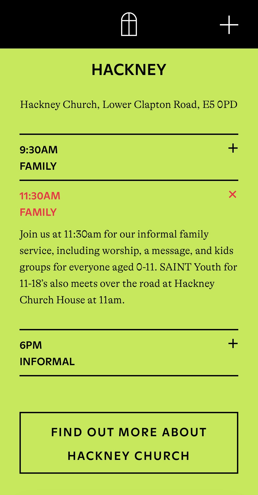

# Cribbins TTFN London Weekend + (Niyati & Chad Oct birthdays Chads was a milestone one as he turned 50 big ones)  
  
Saturday 25th Oct  
  
  
10:30am Brunch:   
Route Haggerston  
[https://caferoute.co.uk/haggerston/](https://caferoute.co.uk/haggerston/)  
Location:   
[https://share.google/oxKA74lZBG4EGc3wp](https://share.google/oxKA74lZBG4EGc3wp)  
Menu:  
[https://caferoute.co.uk/wp-content/uploads/2025/06/PDF-Breakfast-Summer-2025-Menu.pdf](https://caferoute.co.uk/wp-content/uploads/2025/06/PDF-Breakfast-Summer-2025-Menu.pdf)   
  
  
1-5 pm Lunch:  
The Scolts Head  
[https://www.thescolthead.co.uk](https://www.thescolthead.co.uk)  
Location:  
[https://maps.app.goo.gl/jUqVAe5LyQctxBjB8?g_st=ic](https://maps.app.goo.gl/jUqVAe5LyQctxBjB8?g_st=ic)  
Menu:  
[https://www.thescolthead.co.uk/scolt-head/wp-content/uploads/2018/07/SCOLTHEAD_SAMPLE_MENU_SEPT_2024.pdf](https://www.thescolthead.co.uk/scolt-head/wp-content/uploads/2018/07/SCOLTHEAD_SAMPLE_MENU_SEPT_2024.pdf)   
  
6pm Dinner:  
Tonkotsu East  
[https://tonkotsu.co.uk/locations/east/](https://tonkotsu.co.uk/locations/east/)  
Location   
[https://maps.app.goo.gl/ir4x1HfnbgPcNfWs7?g_st=ic](https://maps.app.goo.gl/ir4x1HfnbgPcNfWs7?g_st=ic)  
Menu   
[https://tonkotsu.co.uk/menu/ramen/](https://tonkotsu.co.uk/menu/ramen/)  
  
  
  
Sunday 26th   
  
  
11:30am Morning Service  
Saint Hackney  
[https://saint.church](https://saint.church)  
Location:  
[https://maps.app.goo.gl/V2XRCCARUKaGMg1q9?g_st=ipc](https://maps.app.goo.gl/V2XRCCARUKaGMg1q9?g_st=ipc)  
What’s on:  
[https://saint.church/sunday/](https://saint.church/sunday/)  
  
  
  
2-6pm Lunch   
Spitalfields Market   
[https://www.spitalfields.co.uk](https://www.spitalfields.co.uk)  
Location:   
[https://share.google/1KAHzMm4vH6w9YN7f](https://share.google/1KAHzMm4vH6w9YN7f)  
Menu:   
[https://www.spitalfields.co.uk/food-drinks/](https://www.spitalfields.co.uk/food-drinks/)  
  
  
6/7:30 Evening Movie somewhere:   
  
Option A   
Hackney picture house  
**PHOTOMONTH: FREE PARTY: A FOLK HISTORY + Q&A**  
[7:30PM](https://www.picturehouses.com/movie-details/010/HO00017012/photomonth-free-party-a-folk-history-q-a?filter=)  
  
Option B   
Rich Mix Theatre   
SKATEBOARD FILM CLUB: THIS IS SKATEBOARDING  
[6.00PM](https://richmix.org.uk/book-online/1737402)  
  
Option C   
Or Stratford TBD  
  
Or something else.   
